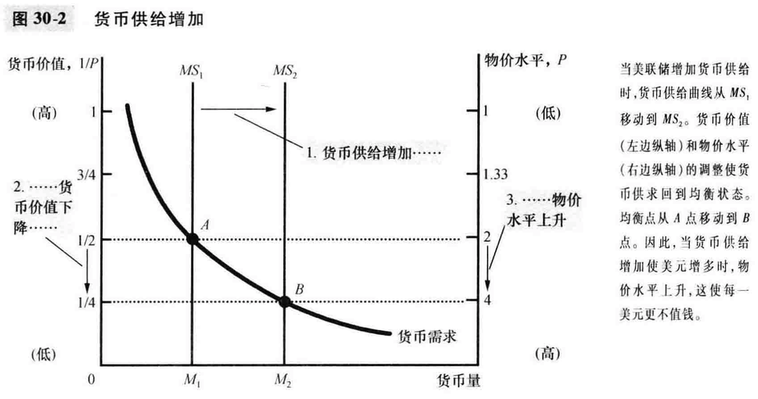

# 30章 货币增长与通货膨胀

### 古典通货膨胀理论

- 物价水平与货币价值

  - 物价水平上升，货币价值下降

- 货币供给、货币需求与货币均衡

  - 物价水平上升增加了货币需求量

  - 在长期中，物价总水平会调整到使货币需求等于货币供给的水平

    

- 货币注入的影响

  - 货币数量论：一种认为可得到的货币量决定物价水平，可得到的货币量的增长率决定通货膨胀率的理论

    

- 调整过程简述

- 古典二分法和货币中性

  - 古典二分法：名义变量(按货币单位衡量)和真实变量(按实物单位衡量)的理论区分
  - 美元价格是名义变量，相对价格是真实变量
  - 货币中性：认为货币供给变动并不影响真实变量的观点
  - 货币中性不完全真实，在短期中，货币变动会对真实变量有影响

- 货币流通速度与货币数量方程式

  - 货币流通速度：货币易手的速度
  - 计算： V = （P * Y）/ M  = 物价水平(GDP平减指数) * 产量(真实GDP) / 货币量
  - 货币数量方程式： V * M = P * Y
  - 货币流通速度基本是稳定的，Y并不受货币供给影响，所以M增加导致P增加

- 通货膨胀税

  - 通货膨胀税：政府通过创造货币而筹集的收入
  - 通货膨胀税较为隐蔽，就像是一种向每个持有货币的人征收的税
  - 政府支出高，税收不足，借款能力有限时，只能印钞票来支付支出，导致高通货膨胀；当政府减少支出时，通货膨胀就结束了

- 费雪效应

  - 费雪效应：名义利率对通货膨胀率所进行的一对一的调整
  - 通货膨胀率高会导致名义利率高，长期中较明显，短期不一定

### 通货膨胀的成本

- 购买力下降？通货膨胀的谬误
  - 通货膨胀本身并没有降低人们的实际购买力
- 皮鞋成本：当通货膨胀鼓励热门减少货币持有量时所浪费的资源
- 菜单成本： 企业改变价格的成本
- 相对价格变动与资源配置不当：通货膨胀使得相对价格变动更大，市场的资源配置作用受限
- 通货膨胀引起的税收扭曲：通膨胀增加了储蓄所赚到的收入的税收负担，减少了储蓄的吸引力
- 混乱与不方便
- 未预期到的通货膨胀的特殊成本：任意的财富再分配
  - 未预期到的物价变动在债务人和债权人之间进行财富再分配
- 通货膨胀不好，但通货紧缩可能更坏
  - 