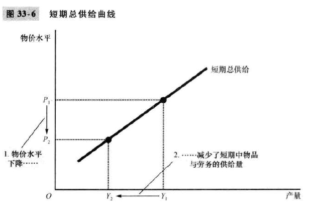

# 33 总需求与总供给

本章目标，**使用<u>总需求</u>和<u>总供给</u>模型来分析事件和政策的<u>短期效用</u>**

### 经济波动的三个关键事实——针对短期

- 经济波动无规律且不可预测
- 大多数宏观经济变量同时波动
- 随着产量减少，失业增加

### 解释短期经济波动

古典经济学假设

短期波动的现实性

总需求和总供给模型

### 总需求曲线

### 总供给曲线

长期垂直：

​		物价是名义变量，不影响实际的<u>劳动，资本，自然资源和技术</u>

移动原因：

- 劳动变动——比如移民

- 资本变动——比如外资进入，厂房开设

- 自然资源——发现矿藏

- 技术知识——AI算法

长期增长和通货膨胀

短期总供给右上方倾斜：

要从企业角度出发（因为是供给曲线）

- 黏性工资理论——物价已经贱了，工资还很高，全部重谈不现实，所以开掉一部分员工，产量就下去了
- 黏性价格理论——物价水平下降，ipad的价格还没有及时掉下来，销量就低了，apple决定减产。
- 错觉理论

### 经济波动的两个原因

