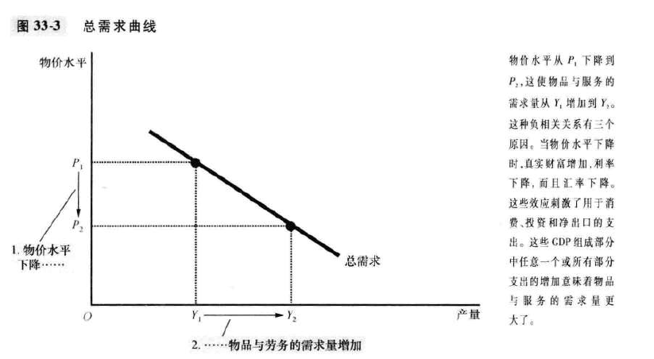
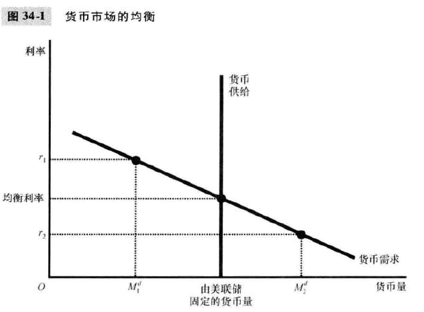
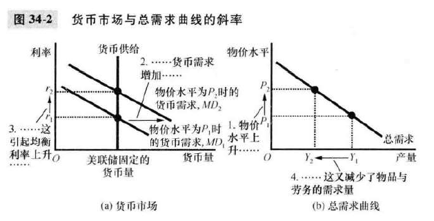
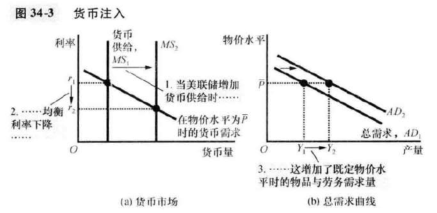

# 34 货币政策和财政政策对总需求的影响

本章主要分析**政府政策工具如何影响总需求曲线**：<u>货币政策，财政政策</u>

## 货币政策如何影响总需求

总需求曲线向右下倾斜的三个原因：

- 财富效应
- 汇率效应
- 利率效应

其中<u>财富效应</u>最不重要，因为货币持有量是家庭财富的一小部分；<u>汇率效应</u>对于依赖进出口的小国很重要；<u>利率效应</u>最重要。

我们准备从利率效应的角度推导一下这个结论。

**step 1，引入 流动偏好理论**

> 定义：利率的调整使得货币供给和货币需求平衡

推导：

- 供给：供给不是市场行为，尤其**不取决利率**。美联储制定完决策，货币供给量就确定了。
- 需求：利率是持有货币的机会成本。利率高，货币需求量就下降——关于这句话，也得分开解释
  - 1、从平民角度：利率高，会尽量把钱变成金融衍生品，这时虽然账目上还叫钱，但是实际已经不是货币了。所以所谓货币，只是指纸币或者硬币。
  - 2、从银行角度：利率高，拿钱的成本就高，需求量自然也少了

**长期利率和短期利率分析是为什么顺序是正好颠倒的？P281**

**step2 利用流动偏好理论分析总需求曲线向右下方倾斜**

- 1、较高的物价增加了货币需求——因为人们要拿更多钱才能买东西

- 2、较高的货币需求引起了较高的利率——存钱的少了，所以利率上升

- 3、较高的利率减少了物品和服务的需求量——<u>这个我没太想清楚</u>

所以得到结论，“物价上升，需求量下降”，说明总需求曲线是斜的，进而可以绘制出下图(b)

平民财富一般由货币+金融品组成。

- 货币--商品：商品变贵，货币需要大量流入，提升了货币需求
- 金融品--货币：金融品被大量兑换成货币，金融品需求量上升，利率上升
- 商品--金融品：商品需要金融品投资制造，金融品少了，商品的制造少了（但这不是供给端吗？！？我们在分析需求啊。。。）

价格上升本身就可以带来家庭的购买物品的减少（收入没有明显提升），企业投资减少确实是因为利率上升。

**货币供给的变动**——货币供给如何影响总需求

货币注入，降低利率，提升了<u>每一种物价下的需求</u>所以整个曲线都移动了

**美联储政策中利率目标的作用**

联邦基金利率——银行相互之间的短期贷款收取的利率

美联储一般调整利率，因为这意味着他承诺将会调整货币供给，使得市场最终稳定在这个利率上。

流动偏好理论说明了利率和货币供给都可以用于描述货币政策。

## 财政政策如何影响总需求

政府购买的变动

乘数效应

挤出效应

税收变动

## 运用政策来稳定经济

**积极政策**

控制过分悲观和过分乐观，因为这些情绪会自我实现

**反对积极政策**

滞后性：财政政策受政治过程影响，时滞数月；而且正确的政策需要正确的对未来预测

**自动稳定器**——避免时滞

税制：衰退时少收，繁荣时多收

政府支出：失业保险or福利在衰退期自动增加，可以刺激总需求