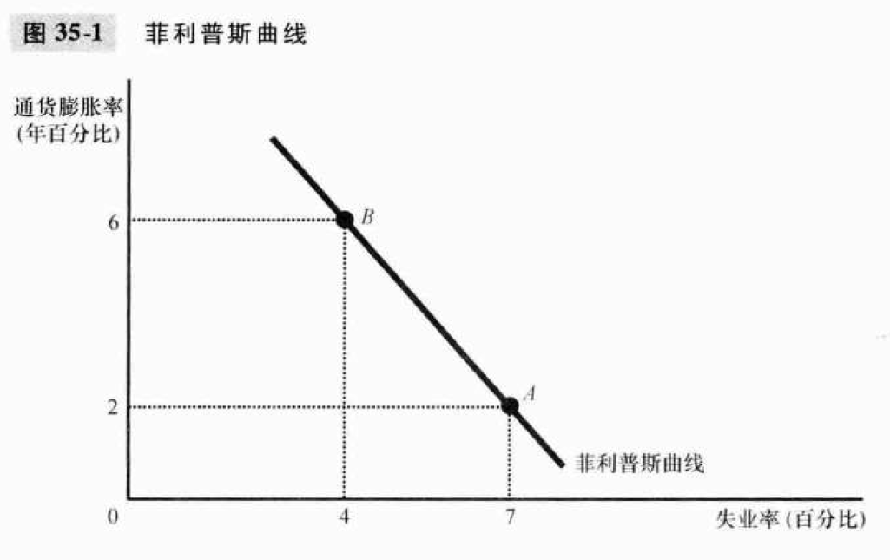
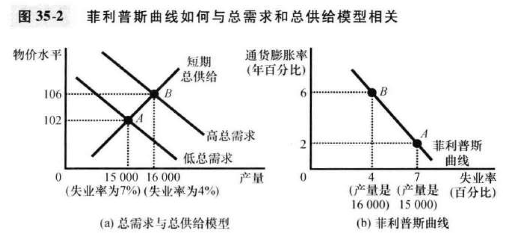
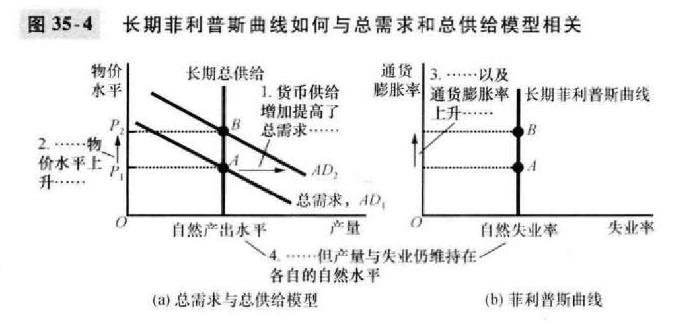
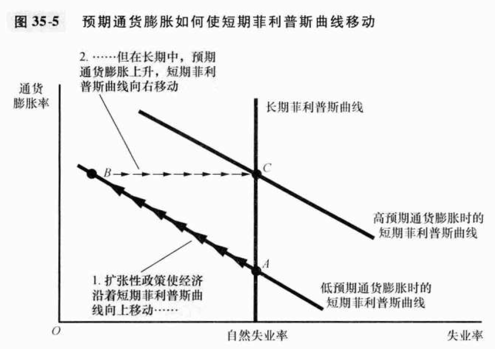
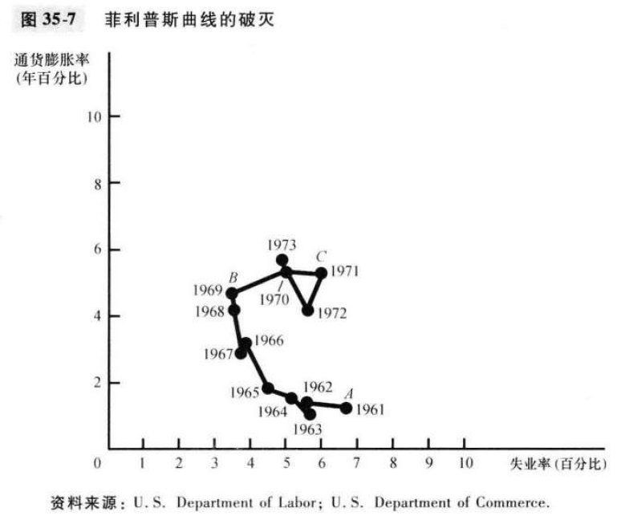
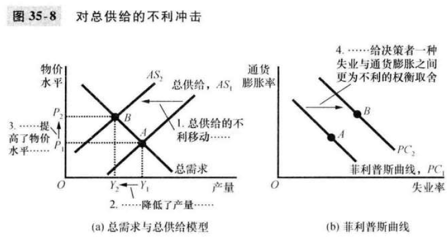
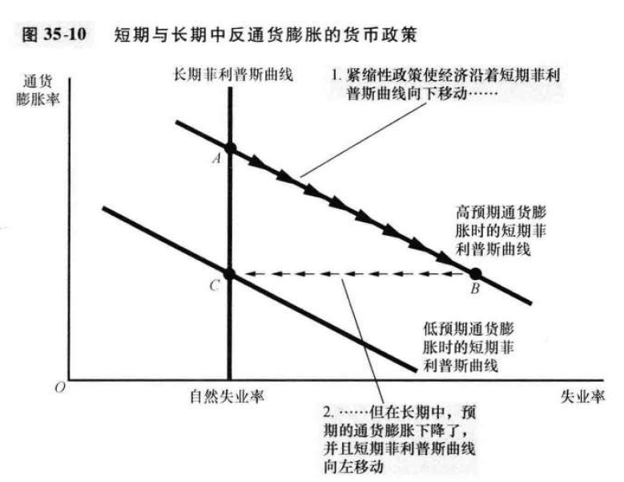

# 35章 通货膨胀与失业之间的短期权衡取舍

长期中通货膨胀与失业互不相关

自然失业率取决于劳动市场的各种特点，要明白失业率其实主要是企业看自己亏不亏

通胀率主要取决于中央银行控制的货币供给增长

### 菲利普斯曲线

- 菲利普斯曲线的由来

  > 一条表示通货膨胀与失业之间的短期权衡取舍的曲线

  猜测：低失业与高总需求相关，而高总需求会带来工资和物价上升的压力

  

- 总需求总供给和菲利普斯曲线

  短期总需求曲线移动，其交点（也就是当前经济）沿着短期总供给曲线移动，下图A-->B

  

### 菲利普斯曲线的移动：预期的作用

- 长期菲利普斯曲线

  **长期中不存在这样的取舍，失业不取决于货币增长和通货膨胀**

  因为长期总供给是垂直的，需求旺盛也不会刺激产量

  

  

- “自然”的含义

  **自然是指其不受货币政策的影响**。比如工会，利用市场势力可以提高工资；但货币增长并没有削弱工会的力量

  劳动市场政策因素可以影响：最低工资法，失业保险，在职培训等

  

- 使理论与证据一致

  引入**<u>预期的通货膨胀</u>**

  短期内的通货膨胀很难预期，因为短期美联储调整货币供给不一定有可预测性；但长期内人们可以预期美联储希望的通货膨胀率，从而及时调整名义工资或者名义价格

  所以长期情况下大家其实预期到了通胀，高的工资不会产生激励，只是不亏。所以总需求也不会突然旺盛

- 短期菲利普斯曲线

  失业率=自然失业率 - α(实际通货膨胀 - 预期通货膨胀)

  解释：短期内如果实际通货膨胀低于预期，那么大家当时签合同的钱就太多了，物价却低。企业亏钱，于是裁员，失业率自然上升；反之，大家企业盆满钵满，雇了很多人。

  

  两条曲线，分别是两种预期下的结果。高通胀预期下的曲线，取舍很艰难，因为曲线上每一个点都比低通胀预期上的坏。

  B-C这段是社会总体逐渐回过神来的过程，社会总体越“机智”，这段时间就越短

  换言之，一个愚蠢的社会，很容易通过扩张性政策在相当长的时期内制造繁荣的假象；但是在机智的地区就不太行

- 自然率假说的自然实验

  美国61-73年

  

  A-B，通胀+失业

  B-C，人们意识到高通胀，薪资不再有吸引力，失业率回落

### 菲利普斯曲线的移动：供给冲击的作用

供给冲击导致滞胀——产量低，价格高

这是外部因素导致的供给曲线的移动

同时公众预期非常重要！

如果大家认为这个高通胀8%是暂时的（公众预期曲线没变），比如认为稳定通胀还是3%，那么决策者只要提供比3%更高的通胀，比如5%，就可以换取低失业率；

但是一旦大家调整了预期，比如认定以后8%就是合理的通胀，那我们还想做trade-off时，就得用10%以上的通胀了

### 降低通货膨胀的代价

- 牺牲率

  >再通货膨胀减少1%的过程中，每年损失的产量百分点数

  

  核心是调整预期！

  就得先让通胀稳定住，然后过一段时间就会调整到到较低的预期，也就是从B-C

  

  A-B是沿着高预期时的移动，大家对于美联储的紧缩表示一脸懵逼，10%的通胀率下你给我按5%发工资，傻子才干！于是大家纷纷失业

  但是发了5年了一直是这样，大家觉得可能以后也不会那么厉害的通胀了，想到这一点，现在看工资合同还顺眼一点，慢慢又开始工作。

  

- 理性预期与无代价的反通货膨胀的可能性

  > 人们充分利用所有信息来预测未来，这里指预期通胀

  如果大家从A点就相信政府将要调整通胀，那么一开始就直接走A-B就好了，这样就是通胀直接下降，没有任何失业率的增加！这就是无代价的反通胀

  但是大家就是不吃亏不长记性啊

  

- 沃尔克的反通货膨胀

  真实世界中，还是有很高代价的；但是代价确实没有之前计算的那么高；

  没有那么高，是因为大家知道沃克反通货膨胀立场非常坚定

  没有降到零，是因为有人们不相信他立刻会采取激进的反通胀措施

  

- 格林斯潘时代

  OPEC被打破，有利冲击使得通胀、失业率同时下降

- 金融危机使美国符合菲利普斯曲线

  