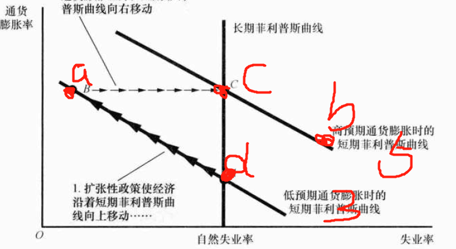
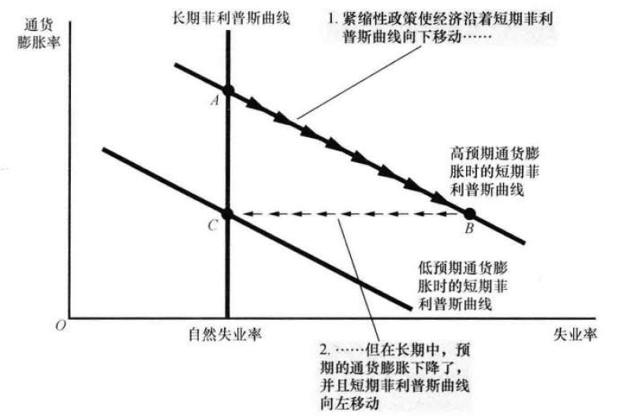

# 35章 通货膨胀与失业之间的短期权衡取舍

1、

忍耐一下我的画工。。。

2、

- A、短期长期都会向右移动
- B、短期向左
- C、曲线不边，经济在短期菲利普斯曲线上移动
- D、短期菲利普斯曲线左移

3、

- 衰退导致物价下降，短期通胀降低，失业升高

  

- 长期预期通胀调整，回到C。到低预期的通胀曲线上是好事（但是代价是很沉重）

4、

- a、

- b、需求减少，失业率上升，通胀下降；扩张的政策会刺激需求，能回到a点

- c、石油的冲击，使人们有高预期的通胀，短期菲利普斯曲线右移，从C移动到AB之间的点；由于**预期变了**，不管怎么政策，只能在高通胀的曲线上移动。

  扩张：去A，高通胀，低失业

  紧缩：去B，低通胀，高失业

5、迅速改变的是理性预期，造成的牺牲率会很小，所以前者会更支持

6、美联储会使用通胀率去想办法控制到4%。在任何一个曲线上，都会采用过分的高通胀，结果人们的通胀预期不断提升，现有的通胀就满足不了他们了，然后美联储只好继续提升通胀，人们继续调整。

7、

- a、缓和。因为调整起来非常灵活，如果1s一签，那么大家根本不需要进行预期了，直接按今天的通胀率给工资就行了
- b、不理性，那就很麻烦了，会拖慢进度
- c、理性社会！！！NB！！瞬间调整（活在梦里）

8、

- 总需求总供给同时减少。均衡产量维持在一个很低的水平，物价不确定，取决于两条曲线左移的相对速度；通胀率一样的道理，

- 扩张啊，拉动内需，需求曲线右移，就可以让ASAD交点在长期总供给上了

- 但是这样做明显不是市场自发的行为，短期供给还是委靡的（外部因素导致的，比如战争，比如政治动荡），**一段时间的印钱让不明就里的人觉得自己能赚钱，才去狠命造东西去卖**，但是其实过几年意识到钱不值钱，他们就又回落了。

  这个过程，其实把大家通胀预期给调高了，以后再想回落，就得牺牲率了。